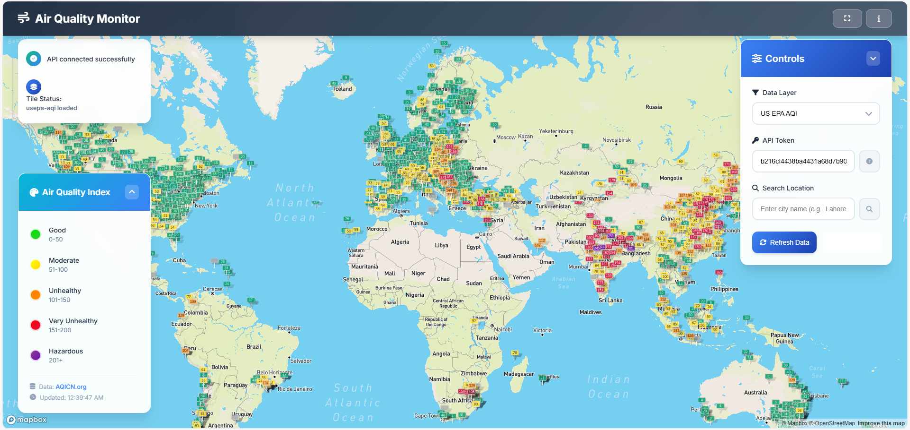

# 🌍 Air Quality Monitor - Real-time WebGIS Application

A professional, interactive web application for real-time air quality monitoring with global coverage and advanced location search capabilities.



## ✨ Features

### 🗺️ Interactive Mapping
- **Global Coverage**: Real-time air quality data worldwide
- **Mapbox GL JS**: High-performance interactive maps
- **Custom Styling**: Professional dark theme with blue-gray gradients
- **Smooth Animations**: Fluid zoom, pan, and navigation

### 🔍 Location Search
- **Smart Geocoding**: Search any city worldwide (e.g., Lahore, New York, London)
- **Autocomplete Suggestions**: Real-time search suggestions as you type
- **Click Navigation**: One-click navigation to searched locations
- **Search Markers**: Visual markers for searched locations

### 📊 Data Visualization
- **Multiple Layers**: US EPA AQI and PM2.5 concentration data
- **Color-coded Indicators**: 
  - 🟢 Good (0-50)
  - 🟡 Moderate (51-100)
  - 🟠 Unhealthy (101-150)
  - 🔴 Very Unhealthy (151-200)
  - 🟣 Hazardous (201+)
- **Real-time Updates**: Live data from AQICN.org API

### 🎨 Modern UI/UX
- **Professional Design**: Sophisticated blue-gray color scheme
- **Glass Morphism**: Modern backdrop blur effects
- **Responsive Layout**: Works on desktop, tablet, and mobile
- **Collapsible Panels**: Space-efficient interface
- **Smooth Animations**: Enhanced user experience

### 🛠️ Technical Features
- **Error Handling**: Robust API error management
- **Status Monitoring**: Real-time connection status
- **Performance Optimized**: Fast loading and smooth interactions
- **Cross-browser Compatible**: Works on all modern browsers

## 🚀 Quick Start

### Prerequisites
- Modern web browser (Chrome, Firefox, Safari, Edge)
- Internet connection for API access

### Installation
1. **Clone the repository**
   ```bash
   git clone https://github.com/yourusername/air-quality-monitor.git
   cd air-quality-monitor
   ```

2. **Open in browser**
   ```bash
   # Using Python (if installed)
   python -m http.server 8000
   
   # Or simply open index.html in your browser
   ```

3. **Access the application**
   - Navigate to `http://localhost:8000`
   - Or open `index.html` directly in your browser

## 🛠️ Technologies Used

### Frontend
- **HTML5**: Semantic structure and accessibility
- **CSS3**: Modern styling with CSS Grid and Flexbox
- **JavaScript (ES6+)**: Interactive functionality and API integration

### Mapping & APIs
- **Mapbox GL JS**: Interactive mapping library
- **Mapbox Geocoding API**: Location search and geocoding
- **AQICN.org API**: Real-time air quality data

### Design
- **Inter Font**: Modern typography
- **Font Awesome**: Professional icons
- **CSS Custom Properties**: Maintainable theming
- **Glass Morphism**: Modern visual effects

## 📱 Responsive Design

The application is fully responsive and optimized for:
- **Desktop**: Full functionality with all features
- **Tablet**: Touch-optimized interface
- **Mobile**: Streamlined mobile experience

## 🌐 API Integration

### Mapbox Services
- **Map Tiles**: High-quality map rendering
- **Geocoding**: Location search and coordinates
- **Access Token**: Required for map functionality

### Air Quality Data
- **AQICN.org**: Real-time air quality data
- **Global Coverage**: Data for cities worldwide
- **Multiple Metrics**: AQI and PM2.5 concentration

## 🎯 Use Cases

- **Environmental Monitoring**: Track air quality in different regions
- **Public Health**: Monitor air quality for health decisions
- **Urban Planning**: Analyze air quality patterns in cities
- **Research**: Study environmental data trends
- **Education**: Learn about air quality and environmental science

## 🔧 Configuration

### Mapbox Token
Update the Mapbox access token in `script.js`:
```javascript
mapboxgl.accessToken = 'your-mapbox-token-here';
```

### AQI API Token
Configure the AQICN.org token in the application interface or update the default value in `index.html`.

## 📊 Performance

- **Fast Loading**: Optimized for quick initial load
- **Smooth Animations**: 60fps transitions and interactions
- **Efficient API Calls**: Debounced search and optimized requests
- **Memory Management**: Proper cleanup of map resources

## 🚀 Deployment

### Static Hosting
Deploy to any static hosting service:
- **GitHub Pages**: Free hosting for public repositories
- **Netlify**: Automatic deployments from Git
- **Vercel**: Fast global CDN
- **AWS S3**: Scalable cloud hosting

### Production Considerations
- **HTTPS**: Required for geolocation and secure APIs
- **CORS**: Configure for cross-origin requests
- **API Limits**: Monitor usage for Mapbox and AQICN APIs

## 🤝 Contributing

1. Fork the repository
2. Create a feature branch (`git checkout -b feature/amazing-feature`)
3. Commit your changes (`git commit -m 'Add amazing feature'`)
4. Push to the branch (`git push origin feature/amazing-feature`)
5. Open a Pull Request

## 📄 License

This project is licensed under the MIT License - see the [LICENSE](LICENSE) file for details.

## 🙏 Acknowledgments

- **Mapbox**: For excellent mapping services and documentation
- **AQICN.org**: For providing real-time air quality data
- **Font Awesome**: For professional icons
- **Inter Font**: For modern typography

## 📞 Support

For support, email your-email@example.com or create an issue in the repository.

---

**Built with ❤️ for environmental awareness and public health**
